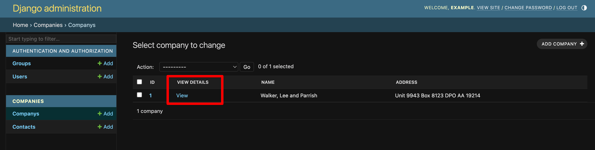
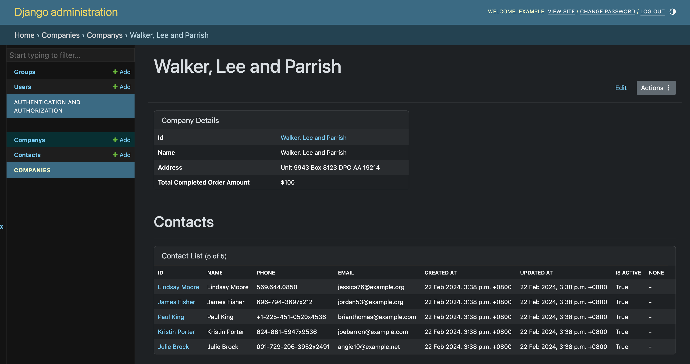
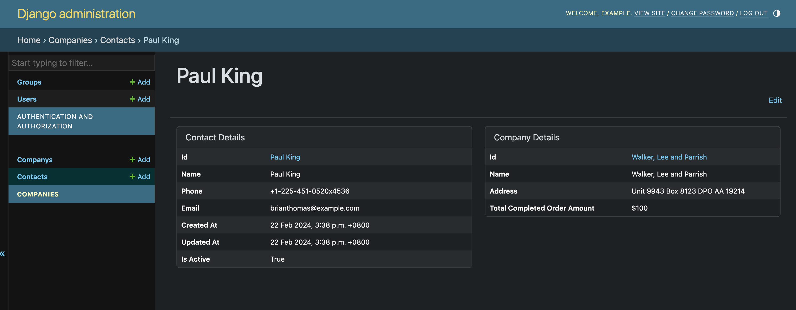

# Django Admin Detail View

Django Admin's missing `DetailView`.

Allows easy creation of a `DetailView` via DSL for an object in Django Admin.







## Why this exists

Django Admin's is missing detail views (by design). It's strengths lie in administering specific objects via form modification.

But, a common need is to allow internal staff/admins to view specific objects and and their related objects. Historically the recommendation was to build a separate website/frontend for this.

## Theory

With models `Company`, `ContactInfo`, `SalesLeads`, `Orders`, Internal staff want to quickly understand the status of a particular `Company` so a simple View displaying these 4 objects is very beneficial.

Then I can drill down into a `Order` and see all related `Product`s, `OrderStatusUpdate`s, `SalesComments`.

Via DSL, it is fast to stand up `DetailView`s for many objects.

## Beliefs

Opinionated, information dense, grid layout. Function over form.

## Core API

- Add View button to `changelist` for Object.
- `detail_table_for()` builds object's details table.
- `table_for()` builds a list of
- `ctx["layout"]` holds the grid structure.

## Pre-reqs

- Bootstrap as Webpack
- webpack_loader

## Install

1. Direct add github to `pyproject.toml`, `git@github.com:jenfi-eng/djadmin-detail-view.git`.
1. Add to `INSTALLED_APPS`
1. Create a `DetailView` and add mixin `AdminDetailMixin`
1. To the object's admin add `AdminChangeListViewDetail` and function `get_default_detail_view`
1. Return the newly created DetailView in `get_default_detail_view`.

See `example_project/companies/admin.py` for reference.

## Code Example

```python
from django.contrib import admin
from djadmin_detail_view.views import AdminChangeListViewDetail, AdminDetailMixin

from my_app.companies.models import Company

@admin.register(Company)
class CompanyAdmin(AdminChangeListViewDetail, admin.ModelAdmin):
    def get_default_detail_view(self):
        return CompanyDetailView

class CompanyDetailView(AdminDetailMixin, DetailView):
    model = Company

    def get_context_data(self, request, *args, **kwargs):
        ctx = super().get_context_data(request, *args, **kwargs)

        company_details = details_table_for(
            panel_name="Company Details",
            obj=self.object,
            details=[
                detail("id"),
                detail("legal_name"),
                detail("tax_id"),
                detail("total_completed_order_amount", value=lambda x: x.total_order_value()),
            ]
        )

        orders_list = table_for(
            panel_name="Orders",
            obj_set=self.object.order_set.all(),
            cols=[
                col("id"),
                col("legal_name"),
                col("total_value"),
                col("created"),
            ]
        )

        ctx["layout"] = [
            {
                "row": [
                    {"col": company_details},
                    {"col": None},
                ],
            },
        ]
```

## Template Helper API Reference

### Layout Helpers

- `details_table_for()` - Creates a detail table for displaying attributes of a single object
- `detail()` - Defines a single detail/column in a details table (alias: `col()`)
- `table_for()` - Creates a list table for displaying multiple related objects

### Lazy Loading

Both `table_for()` and `details_table_for()` support lazy loading to improve initial page load times. When enabled, panels display a spinner and load content via AJAX after the page renders.

```python
# In get_context_data():
orders_list = table_for(
    panel_name="Orders",
    obj_set=self.object.order_set.all(),
    cols=[col("id"), col("status"), col("total")],
    lazy_load=True,
    lazy_key="orders",
    lazy_placeholder="Loading orders...",  # optional
)

# Add a method to return the actual content:
def lazy_orders(self):
    """Called by LazyFragmentView to render the lazy-loaded content."""
    return table_for(
        panel_name="Orders",
        obj_set=self.object.order_set.all(),
        cols=[col("id"), col("status"), col("total")],
    )
```

**Parameters:**
- `lazy_load=True` - Enable lazy loading for this panel
- `lazy_key` - Unique identifier for this panel (required when `lazy_load=True`)
- `lazy_placeholder` - Custom loading message (default: "Loading...")

**How it works:**
1. The panel renders with a Bootstrap spinner placeholder
2. A Stimulus controller fetches content from `/admin/app/model/{pk}/lazy/{lazy_key}/`
3. The endpoint calls your `lazy_{key}()` method and returns the rendered HTML
4. The placeholder is replaced with the actual content

**Error handling:**
- Non-2xx responses display an error message with status code
- Network errors retry automatically (up to 3 times with exponential backoff)
- A "Retry" button allows manual retry after failures

### Menu Helpers

- `top_menu_btn()` - Creates a button for the top menu bar
- `dropdown_item()` - Creates an item for the Actions dropdown menu
- `dropdown_divider()` - Creates a horizontal divider line in the dropdown menu
- `dropdown_header()` - Creates a non-interactive header/label in the dropdown menu

### Auto-formatting

The `detail()` and `col()` helpers automatically format common data types:

- **DateTime**: Formatted using `TEMPLATE_TIME_FORMAT` setting
- **Date**: Formatted using Django's `SHORT_DATE_FORMAT`
- **Money** (moneyed library): Formatted with currency symbol if available
- **ImageFieldFile**: Rendered as `` tag with max dimensions 100x100px
- **None**: Displayed as "-"
- **Model instances**: Auto-linked to admin detail view if col_name is in `AUTOLINK_COL_NAMES` (default: `["id", "legal_name"]`)

## Current Open Source Status

It is currently built for Jenfi and its internal needs. Thus, it has specific requirements such as `django-hosts` and `Money` that may need to be abstracted away.

PRs are welcome for review to make it more generally accessible.

## VSCode

### Testing

Add config to allow specs to be run inside VSCode.

```javascript
// .vscode/settings.json
{
  "python.testing.pytestArgs": [
    ""
  ],
  "python.testing.unittestEnabled": false,
  "python.testing.pytestEnabled": true,
}

```

### Web Launch Config

```javascript
{
    "name": "Django Web",
    "type": "python",
    "request": "launch",
    "program": "${workspaceFolder}/server.py",
    "args": [],
    "django": true,
    "justMyCode": false
},
```

## TODO

1. Allow non-webpack based installs.

## Jenfi Specific Needs

- Handles `Money` (from [py-moneyed](https://github.com/py-moneyed/py-moneyed))
- `django-hosts`

## Credit

This project takes heavy, heavy inspiration from Rail's [ActiveAdmin](https://github.com/activeadmin/activeadmin) and its DSL.
